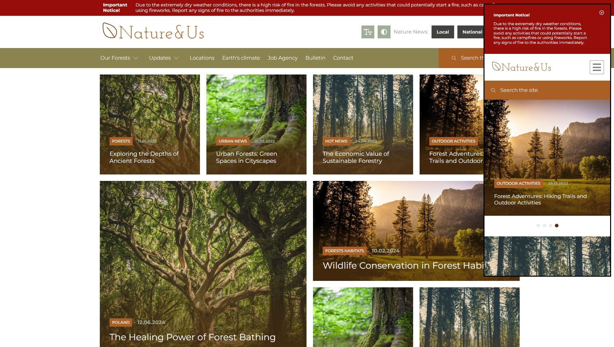

## Table of Contents

- [Technologies](#technologies)
- [Getting Started](#getting-started)
- [Screenshots](#screenshots)

## Technologies

Technologies used:

- React.js library based on the Next.js framework
- TypeScript
- SASS/SCSS

Libraries used:

- Swiper.js

## Getting Started

- Navigate to the project folder
- Install dependencies

```bash
npm i
```

Start the development server:

```bash
npm run dev
# lub
yarn dev
# lub
pnpm dev
# lub
bun dev
```

Open http://localhost:3000 in your browser to see the page.

## Screenshots


